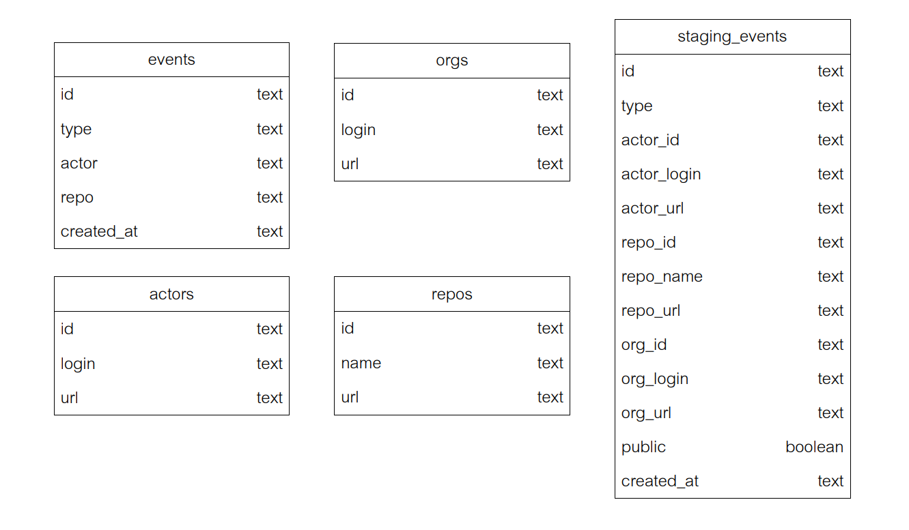
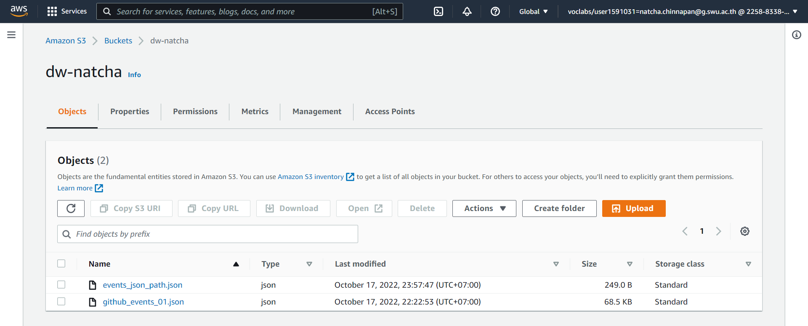
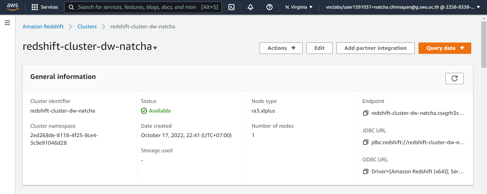
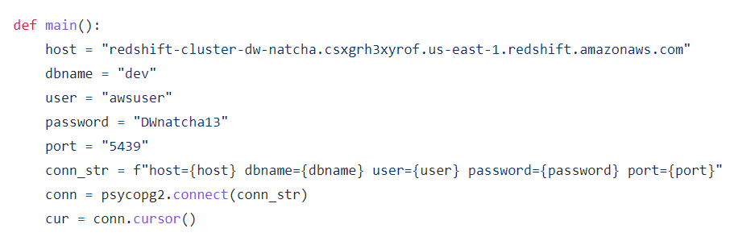
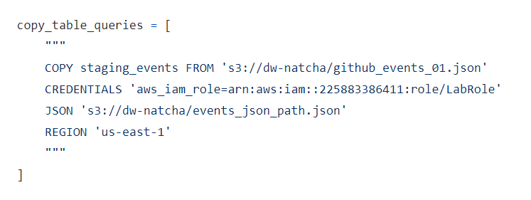

# Building a Data Warehouse

## Data Model


### 1. Create AWS S3


### 2. Create AWS Redshift and enable public


### 3. S3 Connection path


### 4. Redshift Connection path



## Started
### Getting Started
```sh
python -m venv ENV
source ENV/bin/activate
pip install -r requirements.txt
```

### Running ETL Script
```sh
python etl.py
```