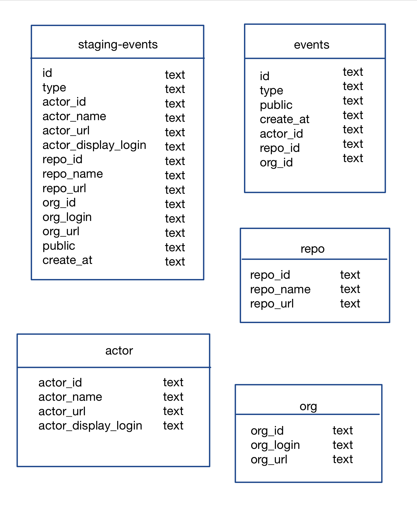
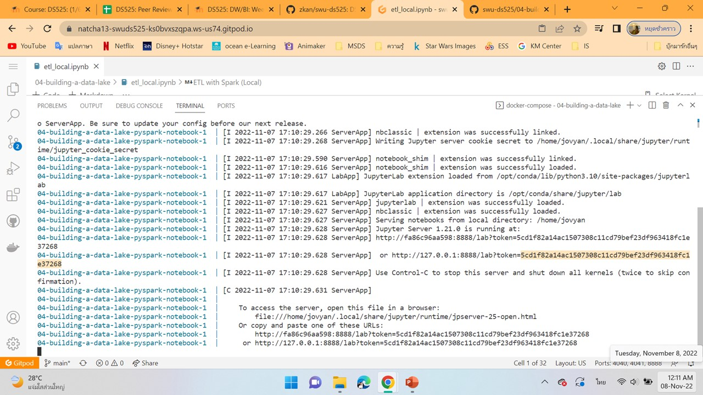

# Building a Data Warehouse

## Data model

<br>

## Getting Started
<br>


### change directory to project 04-building-a-data-lake:
```sh
$ cd 04-building-a-data-lake
```

### applying code for saving jupyter lab
```sh
$ sudo chmod 777
```

### prepare environment workspace by Docker:
```sh
$ docker-compose up
```

### Open JupyterLab URL:
<br>


<br>

### Execute Notebook 'etl_local.ipynb'
<br>

### Check output data in folders
<br>

## Shutdown steps

### Shutdown environment workspace:
```sh
$ docker-compose down
```