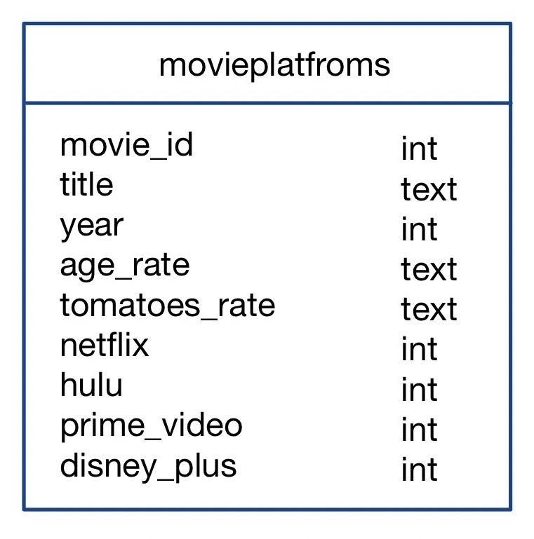

# Capstone Project

## Data model: Data warehouse


## Project Documentation
[Documentation link](https://github.com/Natcha13/swu-ds525/blob/1f487c73dc72a20cbde6f6ed1f93310e1a539aa7/capstone-project/Instruction_Capstone_Project.pdf)

## Run command
```sh
cd capstone-project
python -m venv ENV
source ENV/bin/activate
pip install -r requirements.txt
```

## Prepare your AWS access (GET your credential on AWS terminal)
```sh
cat ~/.aws/credentials
```

## Upload data to S3
```sh
python etl_s3.py
```

## Create table and load data from S3 to Redshift
```sh
python etl.py
```

Running Airflow

```sh
mkdir -p ./dags ./logs ./plugins
echo -e "AIRFLOW_UID=$(id -u)" > .env
```

```sh
docker-compose up
```

## Use dbt for data modeling and data tranforming
Create a dbt project

```sh
dbt init
```

Test dbt connection

```sh
cd movieplatfrom
dbt debug
```
You should see "All checks passed!".

To create models

```sh
dbt run
```


## Dashboard Presentation
[Presentation link](https://github.com/Natcha13/swu-ds525/blob/e99baa9e31bd83a93f8fa96dbd752f2c0fca734d/capstone-project/Dashboard-MoviesOnStreamingPlatforms.pdf)


## And finally do not forget to shutdown

Stop services by shutdown Docker

```sh
docker-compose down
```

- Deactivate the virtual environment 

```sh
$ deactivate
```